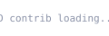

[English](README.md) | [中文](README.zh.md) | [日本語](README.ja.md)

<p align="center">
  
</p>

<p align="center">
  <em>夜空の下、コードの間に。プロジェクトはどれも星、それぞれの夜空に掲げる。</em>
</p>

## プロフィール

```text
badhope / weed33834
```

抽象的なアイデアを触れるインターフェースに落とし込む開発者。フルスタックとクリエイティブなツール作りを中心に、シンプルで質感のあるデザインを好み、画一的なテンプレートを嫌う。コードも星空も同じで、巧みさは細部に宿る。

- **最近取り組んでいること**：インタラクティブな可視化、自動化ワークフロー、思わず頷ける小道具
- **よく使う言語**：TypeScript / Python / Rust
- **座右の銘**：より良くあるより、違ってあれ

## GitHub 統計

<p align="center">
  <a href="https://github-readme-stats.vercel.app/api?username=weed33834&show_icons=true&hide_border=true&bg_color=0B1026&title_color=C9A86A&text_color=F5E6C8&icon_color=C9A86A&ring_color=C9A86A&card_width=320"></a>
  <a href="https://github-readme-stats.vercel.app/api/top-langs/?username=weed33834&hide_border=true&bg_color=0B1026&title_color=C9A86A&text_color=F5E6C8&layout=compact&card_width=320"></a>
</p>

## コントリビューション連続記録

<p align="center">
  <a href="https://streak-stats.demolab.com/?user=weed33834&hide_border=true&background=0B1026&ring=C9A86A&fire=C9A86A&currStreakLabel=C9A86A&sideLabels=F5E6C8&dates=8B92A8&currStreakNum=F5E6C8"></a>
</p>

## トロフィー

<p align="center">
  <a href="https://github-profile-trophy.vercel.app/?username=weed33834&theme=darkhub&no-bg=true&column=7&margin-w=4"></a>
</p>

## アクティビティグラフ

<p align="center">
  <a href="https://github-readme-activity-graph.vercel.app/graph?username=weed33834&bg_color=0B1026&color=C9A86A&line=C9A86A&point=C9A86A&area=true&hide_border=true&height=300&days=30"></a>
</p>

## コントリビューション

<p align="center">
  
</p>

## 3D コントリビューション

<p align="center">
  
</p>

## 技術スタック

<p align="center">
  
</p>

<p align="center">
  
  
  
  
  <br/>
  
  
  
  
</p>

## プロジェクト

### 🎓 AI と教育

<p align="center">
  <a href="https://github.com/weed33834/EduFlow"></a>
  <a href="https://github.com/weed33834/FinPilot"></a>
</p>

<p align="center">
  <a href="https://github.com/weed33834/HumanValue"></a>
  <a href="https://github.com/weed33834/DoctorAgent"></a>
</p>

### 🤖 AI Agent とフレームワーク

<p align="center">
  <a href="https://github.com/weed33834/AgentSeed"></a>
  <a href="https://github.com/weed33834/agent-builder-skill"></a>
</p>

<p align="center">
  <a href="https://github.com/weed33834/JustAgent"></a>
  <a href="https://github.com/weed33834/deadman"></a>
</p>

### 🧭 AI リソースとナビゲーション

<p align="center">
  <a href="https://github.com/weed33834/OpenBox"></a>
</p>

### 🏫 キャンパスとコミュニティ

<p align="center">
  <a href="https://github.com/weed33834/campushub"></a>
</p>

### 🎨 クリエイティブとインタラクティブ

<p align="center">
  <a href="https://github.com/weed33834/compass"></a>
  <a href="https://github.com/weed33834/Anime-Friends"></a>
</p>

### ✍️ コンテンツと自動化

<p align="center">
  <a href="https://github.com/weed33834/cnblogs-skill"></a>
  <a href="https://github.com/weed33834/zhihu-skill"></a>
</p>

### 🌍 ライフとビジネス

<p align="center">
  <a href="https://github.com/weed33834/Traveler"></a>
  <a href="https://github.com/weed33834/KeBaiPay"></a>
</p>

### 🔀 注目の Fork

<p align="center">
  <a href="https://github.com/weed33834/ai-api-gongyi-nav"></a>
  <a href="https://github.com/weed33834/WorldFoundry"></a>
</p>

## オープンソースレーダー

<p align="center">
  注目すべきツールとフレームワーク。
</p>

<p align="center">
  <a href="https://github.com/vercel/next.js"></a>
  <a href="https://github.com/facebook/react"></a>
  <a href="https://github.com/tailwindlabs/tailwindcss"></a>
  <a href="https://github.com/langchain-ai/langchain"></a>
  <br/>
  <a href="https://github.com/microsoft/autogen"></a>
  <a href="https://github.com/vercel/ai"></a>
  <a href="https://github.com/pydantic/pydantic-ai"></a>
  <a href="https://github.com/fastapi/fastapi"></a>
  <br/>
  <a href="https://github.com/docker/docker"></a>
  <a href="https://github.com/astral-sh/uv"></a>
  <a href="https://github.com/microsoft/playwright"></a>
  <a href="https://github.com/anthropics/claude-code"></a>
</p>

## 今日の名言

<p align="center">
  
</p>

## 他の場所

<p align="center">
  <a href="https://github.com/weed33834"></a>
  <a href="https://gitcode.com/badhope"></a>
  <a href="https://gitee.com/badhope"></a>
  <a href="https://blog.csdn.net/weixin_56622231"></a>
</p>

<p align="center">
  
</p>

<p align="center">
  <sub>&copy; badhope/weed33834 &middot; コードを舟として、夜空を観る。</sub>
</p>

## ミラー

このプロフィールは主に **GitHub** でホストされ、GitCode と Gitee にミラーされています。

| プラットフォーム | URL |
|-----------------|-----|
| **GitHub**（メイン） | https://github.com/weed33834 |
| GitCode（ミラー） | https://gitcode.com/badhope/badhope |
| Gitee（ミラー） | https://gitee.com/badhope/badhope |

> コンテンツはプラットフォーム間で手動同期されています。GitHub が正本です。
