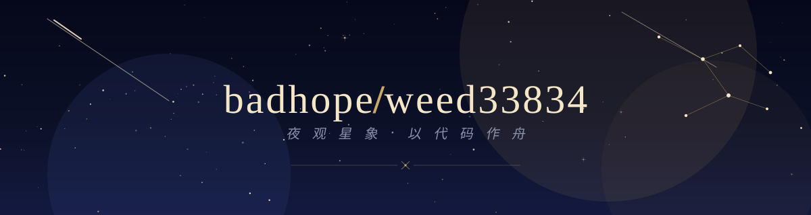
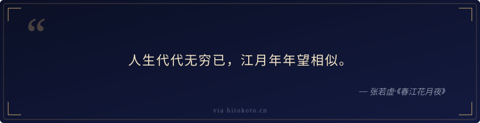
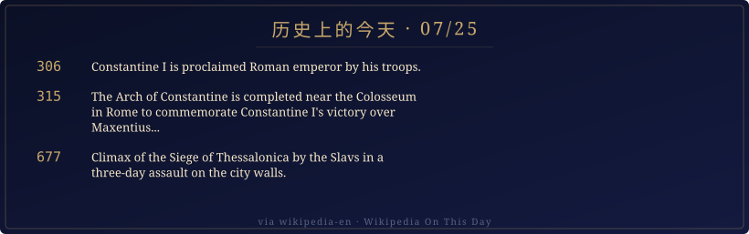

[English](README.md) | [中文](README.zh.md) | [日本語](README.ja.md)

<p align="center">
  
</p>

<p align="center">
  <em>Below the night sky, between the lines of code. Every project is a star, hung in its own sky.</em>
</p>

<p align="center">
  
</p>

## About

```text
badhope / weed33834
```

A developer who turns abstract ideas into tangible interfaces. Focused on full-stack work and creative tooling, with a preference for clean, considered design over yet another template. Code and starlight have this in common: the craft is in the details.

- Currently working on: interactive visualizations, automated workflows, and small tools that earn a knowing smile
- Go-to languages: TypeScript / Python / Rust
- Motto: rather than better, different

<p align="center">
  
</p>

## Tech Stack

<p align="center">
  
  
  
  
  <br/>
  
  
  
  
</p>

<p align="center">
  
</p>

## Featured Projects

<p align="center">
  <a href="https://github.com/weed33834/nova"></a>
  <a href="https://github.com/weed33834/agentvalue"></a>
  <a href="https://github.com/weed33834/echo"></a>
</p>

<p align="center">
  
</p>

## Stats Constellation

<p align="center">
  <a href="https://github.com/weed33834?tab=repositories"></a>
  <a href="https://github.com/weed33834?tab=followers"></a>
  <a href="https://github.com/weed33834?tab=following"></a>
  <br/>
  
</p>

<p align="center">
  
</p>

## Daily Quote

<p align="center">
  
</p>

<p align="center"><sub>Updated daily at 00:00 UTC via GitHub Action · Source: hitokoto.cn (poetry & philosophy)</sub></p>

<p align="center">
  
</p>

## On This Day

<p align="center">
  
</p>

<p align="center"><sub>Updated daily at 00:00 UTC via GitHub Action · Source: Wikipedia On This Day</sub></p>

<p align="center">
  
</p>

## Elsewhere

<p align="center">
  <a href="https://github.com/weed33834"></a>
  <a href="https://gitcode.com/badhope"></a>
  <a href="https://github.com/weed33834?tab=repositories"></a>
</p>

<p align="center">
  
</p>

<p align="center">
  <sub>© badhope/weed33834 · Code as a boat, stargazing by night.</sub>
</p>

## Mirrors / 镜像

This profile is primarily hosted on **GitHub** and mirrored to GitCode and Gitee.

| Platform | URL |
|----------|-----|
| **GitHub** (primary) | https://github.com/weed33834 |
| GitCode (mirror) | https://gitcode.com/badhope/badhope |
| Gitee (mirror) | https://gitee.com/badhope/badhope |

> Content is synchronized manually across platforms. GitHub is the canonical source.
