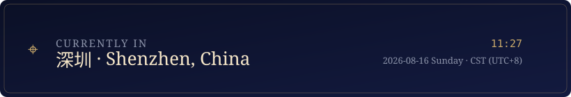
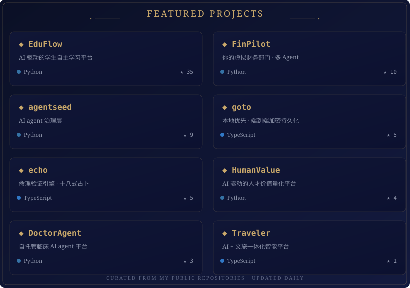
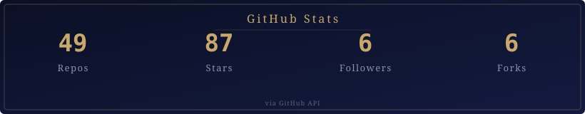
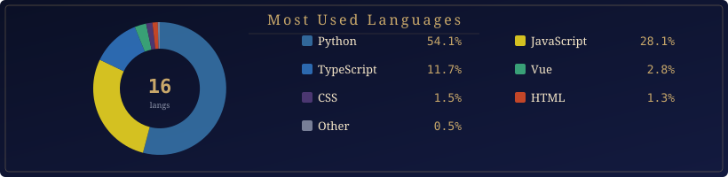
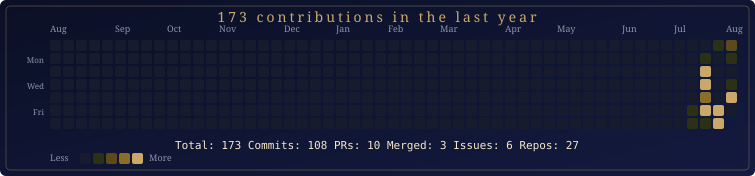

[English](README.md) | [中文](README.zh.md) | [日本語](README.ja.md)

<p align="center">
  
</p>

<p align="center">
  
</p>

<p align="center">
  <em>Below the night sky, between the lines of code. Every project is a star, hung in its own sky.</em>
</p>

<p align="center">
  
</p>

## About

```text
badhope / weed33834
```

A developer who turns abstract ideas into tangible interfaces. Focused on full-stack work and creative tooling, with a preference for clean, considered design over yet another template. Code and starlight have this in common: the craft is in the details.

- **Currently working on**: interactive visualizations, automated workflows, and small tools that earn a knowing smile
- **Go-to languages**: TypeScript / Python / Rust
- **Motto**: rather than better, different

<p align="center">
  
</p>

## Profile

<p align="center">
  
</p>

<p align="center">
  
</p>

<p align="center">
  
</p>

## Tech Stack

<p align="center">
  
</p>

<p align="center">
  
  
  
  
  <br/>
  
  
  
  
</p>

<p align="center">
  
</p>

## Featured Projects

<p align="center">
  
</p>

<p align="center"><sub>EduFlow — AI classroom · FinPilot — virtual finance dept · agentseed — agent governance · goto — encrypted persistence · echo — divination engine · HumanValue — talent value</sub></p>

<p align="center">
  
</p>

## GitHub Stats

<p align="center">
  
</p>

<p align="center">
  <a href="https://github-readme-stats.vercel.app/api?username=weed33834&show_icons=true&hide_border=true&bg_color=0B1026&title_color=C9A86A&text_color=F5E6C8&icon_color=C9A86A&ring_color=C9A86A&card_width=320"></a>
  <a href="https://github-readme-stats.vercel.app/api/top-langs/?username=weed33834&hide_border=true&bg_color=0B1026&title_color=C9A86A&text_color=F5E6C8&layout=compact&card_width=320"></a>
</p>

<p align="center">
  <a href="https://github-profile-trophy.vercel.app/?username=weed33834&theme=darkhub&no-bg=true&column=7&margin-w=4"></a>
</p>

<p align="center">
  <a href="https://streak-stats.demolab.com/?user=weed33834&hide_border=true&background=0B1026&ring=C9A86A&fire=C9A86A&currStreakLabel=C9A86A&sideLabels=F5E6C8&dates=8B92A8&currStreakNum=F5E6C8"></a>
</p>

<p align="center"><sub>Updated daily at 00:00 UTC via GitHub Action · Local SVG always renders; live cards load on GitHub</sub></p>

<p align="center">
  
</p>

## Most Used Languages

<p align="center">
  
</p>

<p align="center"><sub>Aggregated from all non-fork repositories · Updated daily via GitHub Action</sub></p>

<p align="center">
  
</p>

## Contribution Graph

<p align="center">
  
</p>

<p align="center"><sub>Includes commits, PRs, issues, and repository creations · Updated daily via GitHub Action</sub></p>

<p align="center">
  
</p>

## Daily Quote

<p align="center">
  
</p>

<p align="center"><sub>Updated daily at 00:00 UTC via GitHub Action · Source: hitokoto.cn</sub></p>

<p align="center">
  
</p>

## On This Day

<p align="center">
  
</p>

<p align="center"><sub>Updated daily at 00:00 UTC via GitHub Action · Source: Wikipedia</sub></p>

<p align="center">
  
</p>

## Elsewhere

<p align="center">
  <a href="https://github.com/weed33834"></a>
  <a href="https://gitcode.com/badhope"></a>
  <a href="https://gitee.com/badhope"></a>
  <a href="https://blog.csdn.net/weixin_56622231"></a>
</p>

<p align="center">
  
</p>

<p align="center">
  <sub>© badhope/weed33834 · Code as a boat, stargazing by night.</sub>
</p>

## Mirrors / 镜像

This profile is primarily hosted on **GitHub** and mirrored to GitCode and Gitee.

| Platform | URL |
|----------|-----|
| **GitHub** (primary) | https://github.com/weed33834 |
| GitCode (mirror) | https://gitcode.com/badhope/badhope |
| Gitee (mirror) | https://gitee.com/badhope/badhope |

> Content is synchronized manually across platforms. GitHub is the canonical source.
