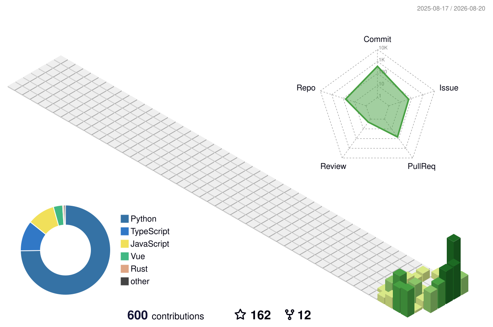

[English](README.md) | [中文](README.zh.md) | [日本語](README.ja.md)

<h1 align="center">badhope / weed33834</h1>

<p align="center">
  <em>夜空之下，代码之间。每个项目都是一颗星，挂在自己的夜空。</em>
</p>

## 关于

```text
badhope / weed33834
```

一名把抽象想法落地为可交互界面的开发者。专注全栈与创意工具，偏爱简洁、有质感的设计，反感千篇一律的模板。代码与星空同理，精巧之处藏在细节里。

- **近期在折腾**：交互可视化、自动化工作流、能让人会心一笑的小工具
- **常用语言**：TypeScript / Python / Rust
- **座右铭**：与其更好，不如不同

## 贡献热力图

<p align="center">
  
</p>

## 3D 贡献图

<p align="center">
  
</p>

## 技术栈

<p align="center">
  
  
  
  
  <br/>
  
  
  
  
</p>

## 项目

### 🎓 AI 与教育

- **[EduFlow](https://github.com/weed33834/EduFlow)** — AI 驱动的学生自主学习平台，AI 助手辅助、学生主导。（Next.js + FastAPI + LangGraph）
- **[FinPilot](https://github.com/weed33834/FinPilot)** — 开源 AI 虚拟财务部：NL2SQL 查询、财务建模、RAG 问答、多智能体辩论。
- **[HumanValue](https://github.com/weed33834/HumanValue)** — AI 人才价值智能平台：9 宫格 / 关键人才 / 薪酬 / 继任分析。
- **[DoctorAgent](https://github.com/weed33834/DoctorAgent)** — 自托管临床 AI 智能体：用药交互安全规则、FHIR R4、HIPAA 合规审计。

### 🤖 AI Agent 与框架

- **[AgentSeed](https://github.com/weed33834/AgentSeed)** — AI 编程智能体治理内核：安全规则 + 场景包，同步 15 个平台。
- **[agent-builder-skill](https://github.com/weed33834/agent-builder-skill)** — 从一句话需求构建生产级 AI 智能体的技能。
- **[JustAgent](https://github.com/weed33834/JustAgent)** — 本地优先的智能配送助手与司法 AI 智能体平台。
- **[deadman](https://github.com/weed33834/deadman)** — 临终关怀与就医导航多智能体 AI 平台。

### 🧭 AI 资源与导航

- **[OpenBox](https://github.com/weed33834/OpenBox)** — 开源 AI 资源导航：13 大类 270+ 精选资源，社区投稿 + 集体验证。

### 🏫 校园与社区

- **[campushub](https://github.com/weed33834/campushub)** — 开源校园兴趣社区（微信小程序 + 云开发）。

### 🎨 创意与交互

- **[compass](https://github.com/weed33834/compass)** — 自托管间隔重复测验工具，FSRS-6 算法（现代 Anki 替代）。
- **[Anime-Friends](https://github.com/weed33834/Anime-Friends)** — 88 位二次元角色 12 维性格精准匹配测试。

### ✍️ 内容与自动化

- **[cnblogs-skill](https://github.com/weed33834/cnblogs-skill)** — 博客园（cnblogs.com）全自动化管理技能。
- **[zhihu-skill](https://github.com/weed33834/zhihu-skill)** — 知乎发文管理工具：AI Agent 框架横评、开发指南。

### 🌍 生活与商业

- **[Traveler](https://github.com/weed33834/Traveler)** — AI 文旅一体化智能体平台（C 端 + B 端 + G 端）。
- **[KeBaiPay](https://github.com/weed33834/KeBaiPay)** — 个人钱包 + 商户收款 + 开放 API + 多平台对账聚合。

### 🔀 精选 Fork

- **[ai-api-gongyi-nav](https://github.com/weed33834/ai-api-gongyi-nav)** — AI API 公益中转站导航：GPT / Claude / Codex / DeepSeek 免费 API。
- **[WorldFoundry](https://github.com/weed33834/WorldFoundry)** — 统一世界模型推理与评估基础设施。

## 开源雷达

<p align="center">
  值得关注的工具和框架。
</p>

<p align="center">
  <a href="https://github.com/vercel/next.js"></a>
  <a href="https://github.com/facebook/react"></a>
  <a href="https://github.com/tailwindlabs/tailwindcss"></a>
  <a href="https://github.com/langchain-ai/langchain"></a>
  <br/>
  <a href="https://github.com/microsoft/autogen"></a>
  <a href="https://github.com/vercel/ai"></a>
  <a href="https://github.com/pydantic/pydantic-ai"></a>
  <a href="https://github.com/fastapi/fastapi"></a>
  <br/>
  <a href="https://github.com/docker/docker"></a>
  <a href="https://github.com/astral-sh/uv"></a>
  <a href="https://github.com/microsoft/playwright"></a>
  <a href="https://github.com/anthropics/claude-code"></a>
</p>

## 在别处

<p align="center">
  <a href="https://github.com/weed33834"></a>
  <a href="https://gitcode.com/badhope"></a>
  <a href="https://gitee.com/badhope"></a>
  <a href="https://blog.csdn.net/weixin_56622231"></a>
</p>

<p align="center">
  <sub>&copy; badhope/weed33834 &middot; 以代码作舟，夜观星象。</sub>
</p>

## 镜像

本主页主要托管在 **GitHub**，并镜像至 GitCode 和 Gitee。

| 平台 | 链接 |
|------|------|
| **GitHub**（主站） | https://github.com/weed33834 |
| GitCode（镜像） | https://gitcode.com/badhope/badhope |
| Gitee（镜像） | https://gitee.com/badhope/badhope |

> 内容跨平台手动同步，GitHub 为权威来源。
